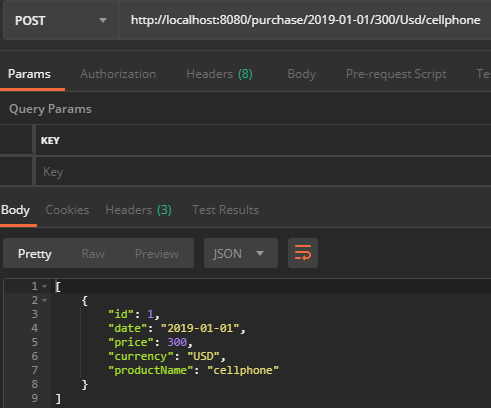

## BusinessStatistic app

Application implements a very basic version of an application for small business owners (e.g. a souvenir shop) who would like to collect information about their income and get annual income statistics.

 ```
http://{app.host}/
 ```
 
By default app running on localhost:8080. If it runs on other host you must go to:

```
src/main/resources/application.properties
 ```
And change property from:
```
app.host=http://localhost:8080
 ```
 to: 
 ```
 app.host={your host here}
  ```
 ## Getting Started
 
 ### Prerequisites
 
 To run this application and use it you will need next:
 
 ```
 Git
 JDK 8 
 Maven 3.6.0 or later
 Postman(or something similar)
 ```
 
 ### Clone
 
 At first you should clone project by Git using URL
 
 ```
 git clone https://github.com/TarasTkhir/TestTaskBusinessStatistic.git
 ```
 
 ### Running the tests
 
 After cloning you can run all tests. To run Tests you have to open command line, choose folder with cloned project and write:
 ```
 mvn test
 ```
 Or you can use your IDE.
 ### Build an run
 
To run application from the command line you have to open command line, choose folder with cloned project and write:
 
 ```
 mvn spring-boot:run
 ```
 Or you can use your IDE.
 
 Or you can build a single executable War file that contains all the necessary dependencies, classes, and resources with:
 ```
 mvn clean package
 ```
 
 
 ### Endpoints

  To see short instruction and all available currencies see (GET):
  ```
  http://localhost:8080/
  ```
 To add purchase and saved it (POST):
   ```
  http://localhost:8080/purchase/{date}/{price}/{currency}/{productName}
   ```
 If you do it write it wood look like that:
 
   
    
   
To find all purchases ordered by date with pagination you can use(GET):
 ```
 http://localhost:8080/all
 ```
To calculate the total income for some year that you want, and convert it in specified currency(GET):  
```
http://localhost:8080/report/{year}/{currency}
```

To remove all purchases for specified date(DELETE):
```
http://localhost:8080/clear/{date}
```
To delete all purchases in database(DELETE):      
```
http://localhost:8080/clear/all
```
 
 ## Author
 
 * **Taras Tkhir** - [GitHub link](https://github.com/TarasTkhir/)
